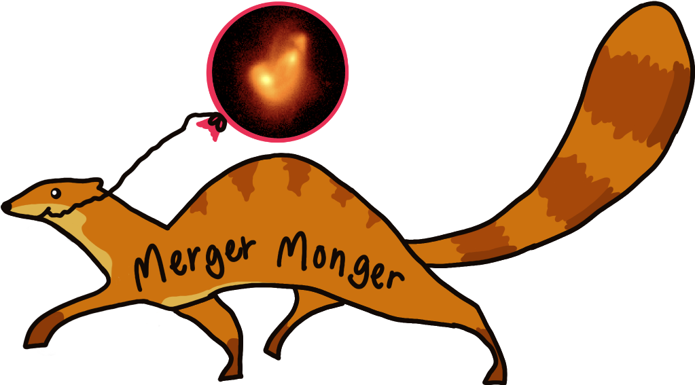
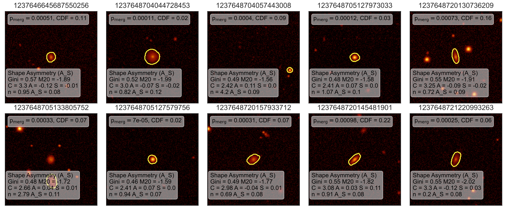
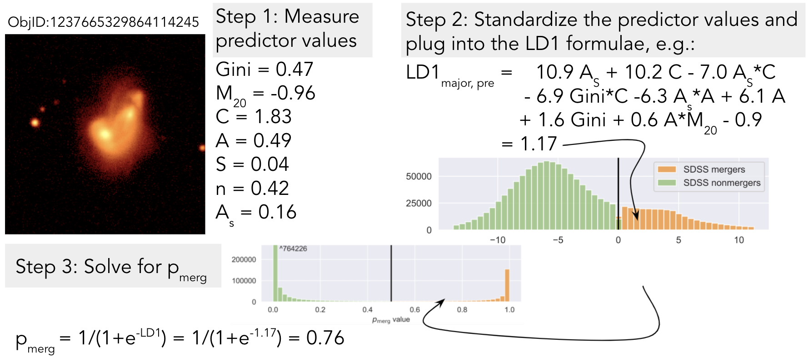

# A suite of tools for identifying different types of mergers in SDSS imaging
Based on the imaging classification presented in <a href="https://arxiv.org/abs/1901.01975">Nevin+2019</a> and Nevin+2022.

There are three main steps: 
1) Creating the classification from simulations of merging galaxies, 
2) Measuring predictor values from images of galaxies, and 
3) Classifying galaxies and obtaining probability values using the output from steps 1 and 2.

Let's dig in:
## 1) Creating the classification from simulations of merging galaxies:


The simulations are fully described in Nevin+2019.

There are several variations of the same function within the MergerMonger.py code that load up the predictor tables from the simulated galaxies and run the LDA using various utilities in util_LDA.py. 
They return three things: 
1) The LDA results, which include information to standardize the predictors, the LDA coefficients, and the LD1 values of the simulated galaxies used as input, 
2) The terms selected by the random forest, and
3) The dataframe used to create the LDA

An example of how to run the classification is provided in classify_SDSS.py. Here's the relevant code:

```
from MergerMonger import load_LDA_from_simulation

run = 'major_merger'

# load_LDA_from_simulation loads in a Table of predictor values from the simulation (LDA_merged_'+str(run)+'.txt')
LDA, RFR, df = load_LDA_from_simulation(run, verbose=False, plot=False)

print('~~~~~~~~~~~~~~~~~~~~~~~~~~~~~~Output from LDA~~~~~~~~~~~~~~~~~~~~~~~~~~~')
print('selected features', LDA[2])
print('coefficients', LDA[3])
print('intercept', LDA[4])
print('accuracy, precision, and recall for simulated galaxies [5-7]', LDA[5], LDA[6], LDA[7])

print('Standardized means LDA[0]', LDA[0])
print('standardized stds LDA[1]', LDA[1])
print('~~~~~~~~~~~~~~~~~~~~~~~~~~~~~~~~~~~~~~~~~~~~~~~~~~~~~~~~~~~~')
print('~~~~~~~~~~~~~~~~~Output from RFR~~~~~~~~~~~~~~~~~~~~~~~~~~~')
print(RFR)
print('~~~~~~~~~~~~~~~~~~~~~~~~~~~~~~~~~~~~~~~~~~~~~~~~~~~~~~~~~~')


# All of the dimensions of `LDA':
# 0 = standardized means on all of the coefficients
# 1 = standardized stds
# 2 = inputs
# 3 = coefficients
# 4 = intercept
# 5 = Accuracy
# 6 = Precision
# 7 = Recall
# 8 = LDA values of all simulated galaxies
# 9 = myr
# 10 = myr_non
# 11 = covariance matrix
# 12 = means of all classes

```

Other versions of the load_LDA_from_simulation function are:

-load_LDA_from_simulation_sliding_time, which allows you to adjust the time of post-coalescence cut-off

-load_LDA_from_simulation_changing_priors, which allows you to input the starting prior, we used this to explore how changing the input prior alters the measured merger fraction

-load_LDA_from_simulation_changing_priors_changing_validation_set, which allows you to play around with the relative fraction of mergers in the validation set

## 2) Measure predictor values from images (GalaxySmelter):
Within util_smelter.py, there are a number of utilities for creating massive tables of predictor values. I also include some utilities for visualizing individual galaxies and their predictor values like this:



The basic process involves first using util_SDSS.py to download SDSS frame images and then using util_smelter.py to measure imaging predictor values from these images. This process utilizes a combination of Source Extractor, Galfit, and statmorph to measure Gini, M20, Concentration, Asymmetry, Clumpiness, Sersic n, Shape Asymmetry, and average S/N value for SDSS r-band images that are downloaded using wget. Within util_smelter.py there are some tools for automatically downloading and then options for deleting SDSS frame images as you go, which is nice because these files are huge. 

Here's an example of how to use these utilities to download galaxies from a list of IDs, make cutout images, measure the imaging predictor values for these images, and save them to a table that is the input for step #3:

```
from util_SDSS import SDSS_objid_to_values, download_galaxy
from util_smelter import get_predictors
import pandas as pd

# Path to where you're storing all of the tables:
prefix = '/Users/rebeccanevin/Documents/CfA_Code/MergerMonger/Tables/'

# Load in the predictor table from SDSS with all of the flags
df_predictors = pd.io.parsers.read_csv(prefix+'SDSS_predictors_all_flags_plus_segmap.txt', sep='\t')

#df_predictors.columns = ['ID','Sep','Flux Ratio',  'Gini','M20','Concentration (C)','Asymmetry (A)','Clumpiness (S)','Sersic N','Shape Asymmetry (A_S)', 'Sersic AR', 'S/N', 'Sersic N Statmorph', 'A_S Statmorph']

if len(df_predictors.columns) ==15: #then you have to delete the first column which is an empty index
    df_predictors = df_predictors.iloc[: , 1:]
  
# Change the type of the ID in predictors:
df_predictors = df_predictors.astype({'ID': 'int64'})#.dtypes 

# Choose only clean galaxies (not flagged):
df_no_flags = df_predictors[(df_predictors['low S/N']==0) & (df_predictors['outlier predictor']==0) & (df_predictors['segmap']==0)]
print('length of no flags', len(df_no_flags))

# Select the first 200 IDs
ID_list = df_no_flags['ID'].values[0:200]

# Alternately, you could just input a list of your own IDs:
# i.e., these are GalaxyZoo spirals that are classified as non-mergers by my major merger classifier:
# ID_list = [1237655693557170541, 1237648673456455904, 1237668649315008771, 1237668649315074455, 1237668649315205346, 1237668568247370040, 1237668649852076495, 1237668649852207363, 1237668568784437849, 1237668568784437611, 1237668568784503051, 1237668568784503170, 1237668650389340761, 1237668650926342749, 1237668650926342753, 1237668650926408199, 1237668569858638234, 1237668650926539340, 1237668569858703829, 1237668569858703926]

# Go through and look up the RAs and Decs, alternately enter in your own:
ra_dec_lookup = pd.read_csv('../Tables/five_sigma_detection_saturated_mode1_beckynevin.csv')
RA_list = []
dec_list = []

for j in range(len(ID_list)):
    counter = 0
    for i in range(len(ra_dec_lookup)):
        if ID_list[j]==ra_dec_lookup['objID'].values[i]:
            RA_list.append(ra_dec_lookup['ra'].values[i])
            dec_list.append(ra_dec_lookup['dec'].values[i])
            counter+=1
    if counter==0:
        RA_list.append(0)
        dec_list.append(0)

for i in range(len(ID_list)):
	# First, uses wget to download the frame corresponding to this individual galaxy. 
	# SO YOU MUST HAVE WGET INSTALLED
	# Makes a cutout in arcsec corresponding to 'size'
	# Also automatically removes the frame once you're done
	# Returns a 2D array that is the image cutout of this galaxy
	img = download_galaxy(id, ra, dec, prefix+'../frames/', size, remove=True)

	# Now measure the predictors
	# The function get_predictors writes out a single line in a data table with all of the predictor values for a single galaxy image:
	preds = get_predictors(id, img, prefix+'../', size)
	# The output is:
	# return camera_data, segmap, gini, m20, con, asy, clu, ser, n, inc, s_n
	# 0 is the image, 1 is the segmentation map used to measure the imaging predictors, gini, m20, C, A, S, sersic n, inclination from galfit, and S/N from statmorph
```
Examples of running this for a list of SDSS IDs can be seen in find_galaxy_check_predictors_and_segmap.py, where you have the option to measure predictor values. find_galaxy.py downloads galaxies by ID but uses their predictor values from the existing table.

Also in util_smelter.py, I include utilities that I used on the supercomputer to run the full SDSS dataset in parallel. 

## 3) Classify galaxies and obtain merger probability values:
The final step is to apply the LDA classification derived in step #1 to the predictor value tables generated in step #2 to obtain probability values. Here's a schematic of how this works:



Code example of how to generate the output probability tables (.txt) are provided in classify_SDSS.py. Here's a snippet:

```
from MergerMonger import classify

# After running step #1:
LDA, p_merg, CDF = classify('../Tables/','../frames/',type_gal, run, LDA, RFR, df, 10000, verbose=True, all = False, cut_flagged = True)
# The classify utility in MergerMonger.py loads up the predictor value table (SDSS_predictors_all.txt), 
# standardizes all values, 
# plugs them into the LD1 formula for a given classification, 
# and saves an LDA table (LDA_out_all_SDSS_predictors....txt) with the LD1 and probability values.

```

I also include some utilities for interpreting these probability values using the CDF of the full population. compare_pmerg_to_full_population_CDF.py does this by importing the saved LDA table and constructing an CDF from all of the p_merg values. This code can then be used to find the p_merg value that would correspond to some point on the CDF (i.e., when 10% of the full population has a higher p_merg value). It can also of course be used to find the CDF value for a given p_merg value to compare a given galaxy's probability to the full SDSS population.


## Dependencies

You must have this stuff installed and updated for everything to run smoothly:
1) Galfit (directions for installing Galfit and Source Extractor are provided in the imaging/ folder)
2) Source Extractor
3) Statmorph
4) wget
5) non-standard python stuff: astropy (vers), photutils, sklearn (vers), seaborn 
